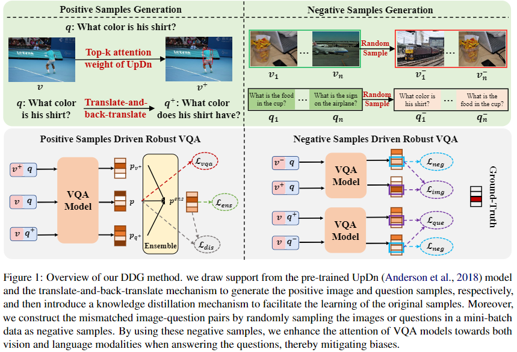

# DDG
We provide the PyTorch implementation for [Digging out Discrimination Information from Generated Samples for Robust Visual Question Answering] (ACL 2023 Findings).

<p align="center">

</p>

## Dependencies
* Python 3.6
* PyTorch 1.1.0
* dependencies in requirements.txt
* We train and evaluate all of the models based on one TITAN Xp GPU

## Getting Started

### Installation
1. Clone this repository:

        git clone https://github.com/Zhiquan-Wen/DDG
        cd DDG

2. Install PyTorch and other dependencies:

        pip install -r requirements.txt


### Download and preprocess the data

```
cd data 
bash download.sh
python preprocess_features.py --input_tsv_folder features.tsv --output_h5 features.h5
python feature_preprocess.py --input_h5 features.h5 --output_path trainval 
python create_dictionary.py --dataroot vqacp2/
python preprocess_text.py --dataroot vqacp2/ --version v2
cd ..
```

### Training
* Train our model
```
CUDA_VISIBLE_DEVICES=0 python main.py --dataroot data/vqacp2/ --img_root data/coco/trainval_features --output saved_models_cp2/ --self_loss_weight 3 --self_loss_q 0.7 --kl_loss_weight 1.0 --dis_loss_weight 0.05 --pos_k 10
``` 

* Train the model with 80% of the original training set
```
CUDA_VISIBLE_DEVICES=0 python main.py --dataroot data/vqacp2/ --img_root data/coco/trainval_features --output saved_models_cp2/ --self_loss_weight 3 --self_loss_q 0.7 --kl_loss_weight 1.0 --dis_loss_weight 0.05 --pos_k 10 --ratio 0.8 
```

### Evaluation
* A json file of results from the test set can be produced with:
```
CUDA_VISIBLE_DEVICES=0 python test.py --dataroot data/vqacp2/ --img_root data/coco/trainval_features --checkpoint_path saved_models_cp2/best_model.pth --output saved_models_cp2/result/
```
* Compute detailed accuracy for each answer type:
```
python comput_score.py --input saved_models_cp2/result/XX.json --dataroot data/vqacp2/
```

### Pretrained model
A well-trained model can be found [here](https://github.com/Zhiquan-Wen/DDG/releases/download/Models/best_model.pth) with [raw training log](https://github.com/Zhiquan-Wen/DDG/releases/download/Results/results.txt). The test results file produced by it can be found [here](https://github.com/Zhiquan-Wen/DDG/releases/download/Test_Results/61.22.json) and its performance is as follows:
```
Overall score: 61.22
Yes/No: 89.47 Num: 48.70 other: 49.86
```  

## Quick Reproduce

1. **Preparing enviroments**: we prepare a docker image (built from [Dockerfile](https://github.com/Zhiquan-Wen/D-VQA/blob/master/docker/Dockerfile)) which has included above dependencies, you can pull this image from dockerhub or aliyun registry:

```
docker pull zhiquanwen/debias_vqa:v1
```


```
docker pull registry.cn-shenzhen.aliyuncs.com/wenzhiquan/debias_vqa:v1
docker tag registry.cn-shenzhen.aliyuncs.com/wenzhiquan/debias_vqa:v1 zhiquanwen/debias_vqa:v1
```

2. **Start docker container**: start the container by mapping the dataset in it:

```
docker run --gpus all -it --ipc=host --network=host --shm-size 32g -v /host/path/to/data:/xxx:ro zhiquanwen/debias_vqa:v1
```

3. **Running**: refer to `Download and preprocess the data`, `Training` and `Evaluation` steps in `Getting Started`.


## Reference
If you found this code is useful, please cite the following paper:
```
@inproceedings{DDG,
  title     = {Digging out Discrimination Information from Generated Samples for Robust Visual Question Answering},
  author    = {Zhiquan Wen, 
               Yaowei Wang, 
               Mingkui Tan, 
               Qingyao Wu, 
               Qi Wu},
  booktitle = {ACL Findings},
  year = {2023}
}
```

## Acknowledgements
This repository contains code modified from [SSL-VQA](https://github.com/CrossmodalGroup/SSL-VQA), thank you very much!

Besides, we thank Yaofo Chen for providing [MIO](https://github.com/chenyaofo/mio) library to accelerate the data loading.
